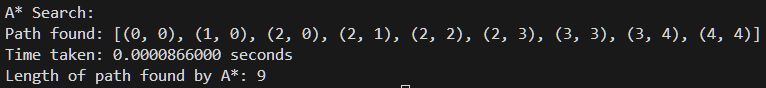

# Pathfinding Algorithms

## Overview

This project implements two pathfinding algorithms in Python:
- **A\* Search**: An algorithm that finds the shortest path by considering both the cost to reach a node and the estimated cost to the goal.
- **Greedy Best-First Search**: An algorithm that explores the most promising nodes based on a heuristic.

## How to Run the Code

1. Clone the repository:
   ```bash
   git clone https://github.com/markintoshplus/CSEG5-MidtermLabExam-Pathfinding-Algos.git
   ```
2. Navigate to the project directory:
   ```bash
   cd CSEG5-MidtermLabExam-Pathfinding-Algos
   ```
3. Run the Python script:
   ```bash
   python main.py
   ```

## Approach and Challenges

### Approach

- **Node Representation**: Each node is represented by a `PathNode` class, which includes its position, cost from the start, estimated cost to the goal, and a reference to the previous node.
- **Heuristic**: The Manhattan distance is used as the heuristic to estimate the cost to the goal.
- **Priority Queue**: A priority queue is used to explore nodes in order of their estimated total cost.

### Challenges

- Ensuring the algorithms correctly handle obstacles and boundaries.
- Optimizing the performance to handle larger grids efficiently.

## Screenshots

### Greedy Best-First Search


### A* Search
